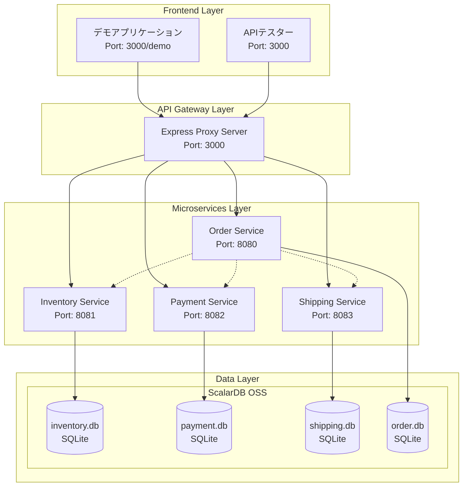
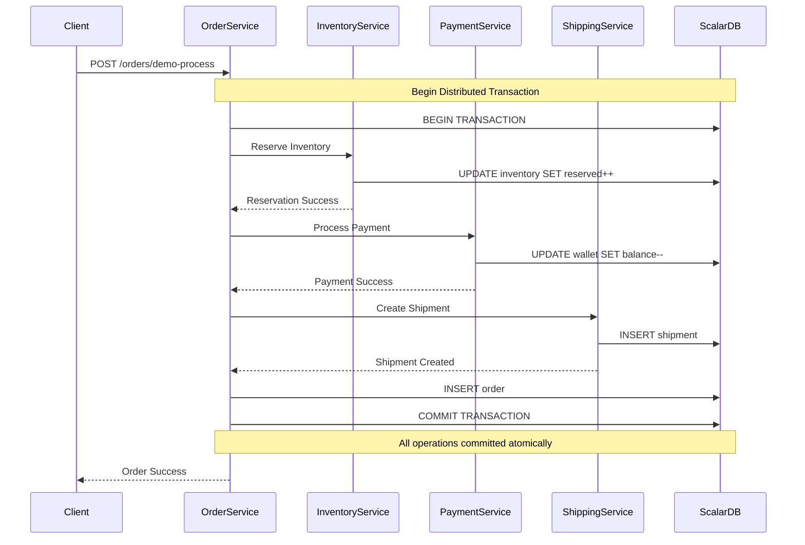
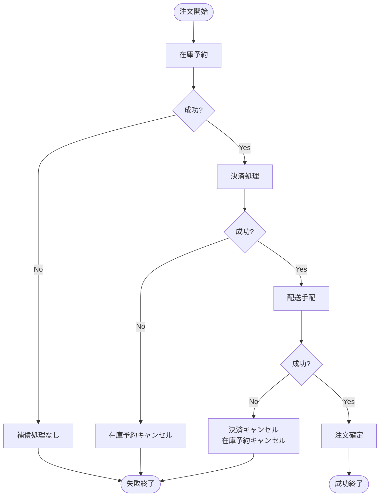
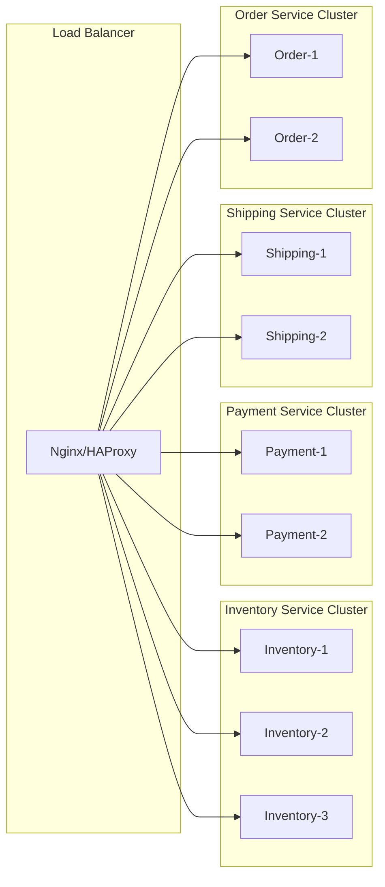
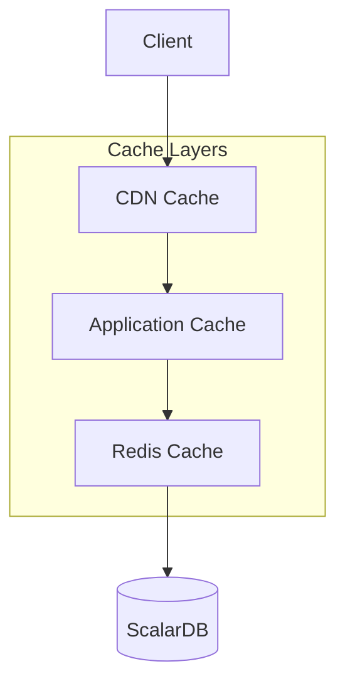
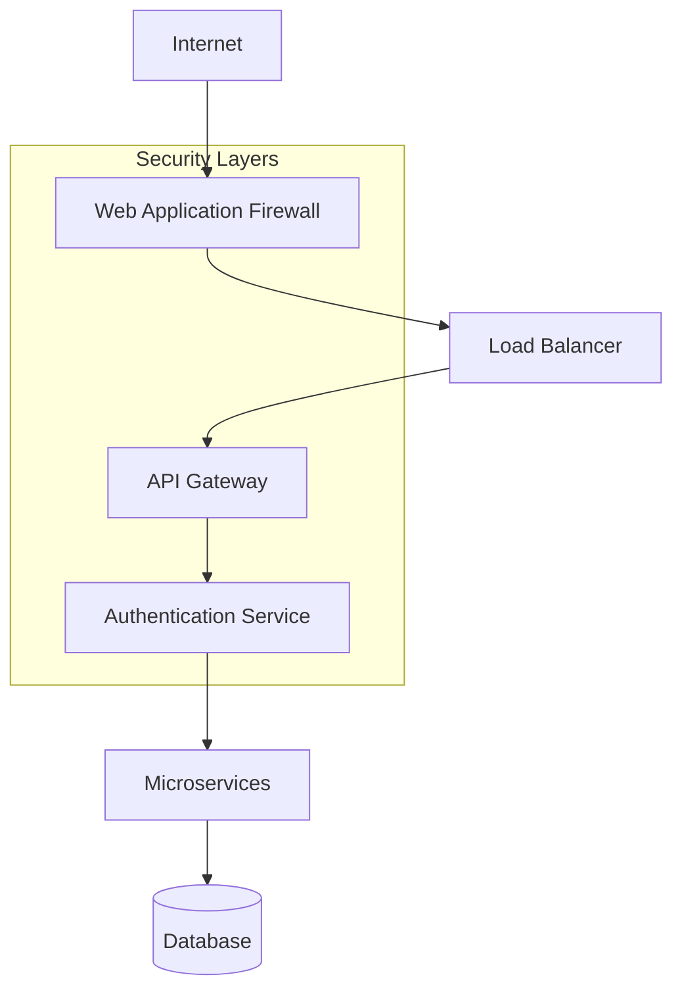
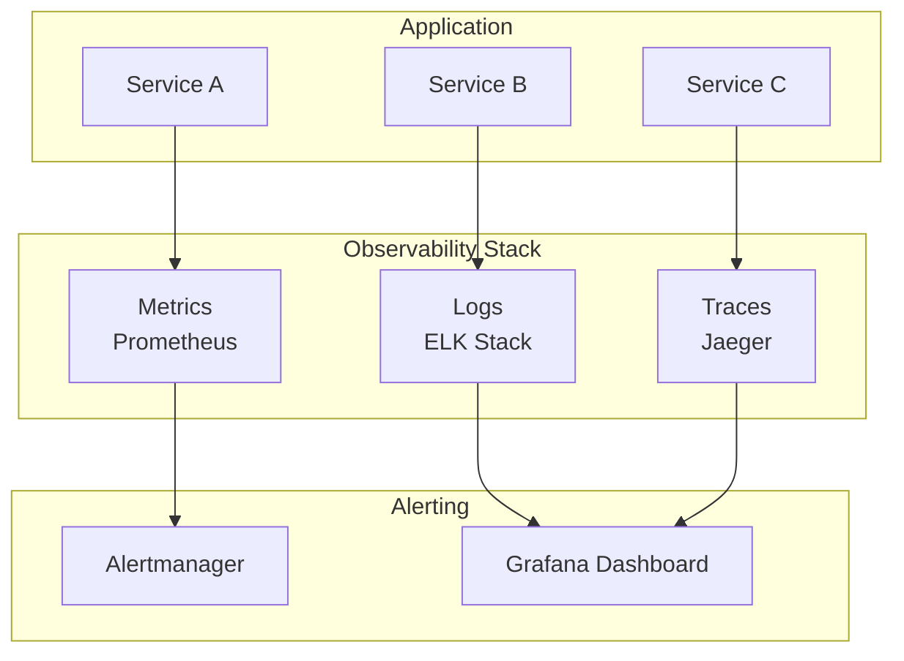
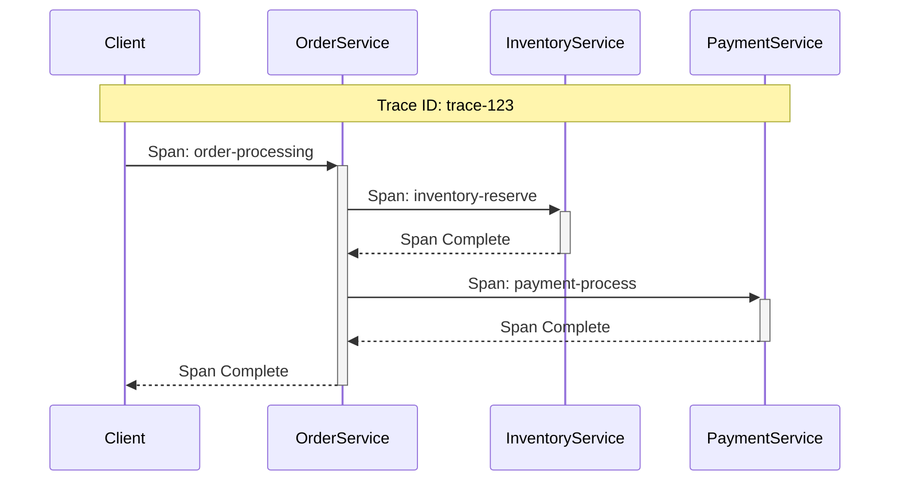
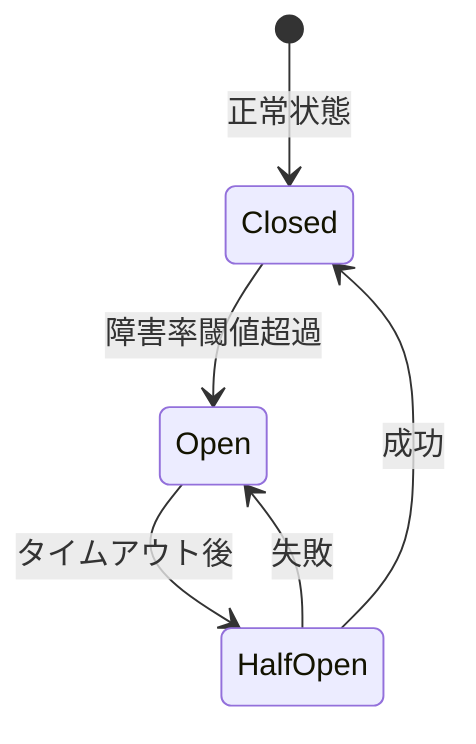
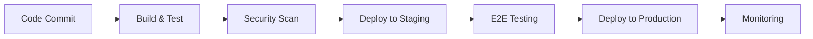

# ScalarDB マイクロサービス アーキテクチャ設計書

## 📐 アーキテクチャ概要

本システムは ScalarDB OSS を基盤とした分散トランザクション対応マイクロサービスアーキテクチャです。各サービスが独立してスケールでき、ACID特性を保証した分散トランザクションを実現しています。

## 🏗️ システムアーキテクチャ

### 全体構成図



### レイヤード アーキテクチャ

| レイヤー | 責務 | 技術スタック |
|---------|------|------------|
| **プレゼンテーション層** | UI/UX、ユーザーインタラクション | HTML5, CSS3, JavaScript ES6+ |
| **API ゲートウェイ層** | ルーティング、CORS、プロキシ | Express.js, http-proxy-middleware |
| **アプリケーション層** | ビジネスロジック、サービス間連携 | Node.js, Express.js |
| **データアクセス層** | 分散トランザクション、データ永続化 | ScalarDB OSS |
| **データ層** | データストレージ | SQLite |

## 🔧 マイクロサービス設計

### サービス分割原則

#### Domain-Driven Design (DDD)
各サービスは明確な業務ドメインに基づいて分割されています：

- **Inventory Service**: 在庫管理ドメイン
- **Payment Service**: 決済処理ドメイン  
- **Shipping Service**: 配送管理ドメイン
- **Order Service**: 注文統合ドメイン

#### 単一責任原則
各サービスは特定の業務機能に特化し、独立してデプロイ・スケール可能です。

### サービス詳細設計

#### 1. Inventory Service (在庫管理サービス)

**責務:**
- 商品在庫の管理
- 在庫予約・確定・キャンセル
- 在庫補充処理
- 在庫可用性チェック

**データモデル:**
```javascript
// 在庫アイテム
{
  productId: String,          // 商品ID (PK)
  productName: String,        // 商品名
  category: String,           // カテゴリ
  quantity: Number,           // 総在庫数
  reservedQuantity: Number,   // 予約済み数量
  availableQuantity: Number,  // 利用可能数量
  unitPrice: Number,         // 単価
  lowStockThreshold: Number, // 低在庫閾値
  lastUpdated: Date          // 最終更新日時
}

// 在庫予約
{
  reservationId: String,     // 予約ID (PK)
  orderId: String,          // 注文ID
  customerId: String,       // 顧客ID
  items: Array,             // 予約アイテム一覧
  status: String,           // 予約状態
  expiresAt: Date,          // 有効期限
  createdAt: Date           // 作成日時
}
```

#### 2. Payment Service (決済サービス)

**責務:**
- 決済処理実行
- 返金処理
- ウォレット管理
- 決済履歴管理

**データモデル:**
```javascript
// 決済記録
{
  paymentId: String,        // 決済ID (PK)
  orderId: String,          // 注文ID
  customerId: String,       // 顧客ID
  amount: Number,           // 決済金額
  currency: String,         // 通貨
  paymentMethod: String,    // 決済方法
  status: String,           // 決済状態
  transactionId: String,    // トランザクションID
  processedAt: Date,        // 処理日時
  providerResponse: Object  // 決済プロバイダーレスポンス
}

// ウォレット
{
  customerId: String,       // 顧客ID (PK)
  balance: Number,          // 残高
  currency: String,         // 通貨
  lastUpdated: Date         // 最終更新日時
}
```

#### 3. Shipping Service (配送サービス)

**責務:**
- 配送手配
- 配送状況管理
- 追跡番号生成
- 配送履歴管理

**データモデル:**
```javascript
// 配送情報
{
  shipmentId: String,       // 配送ID (PK)
  orderId: String,          // 注文ID
  customerId: String,       // 顧客ID
  shippingAddress: Object,  // 配送先住所
  items: Array,             // 配送アイテム一覧
  status: String,           // 配送状態
  trackingNumber: String,   // 追跡番号
  carrier: String,          // 配送業者
  estimatedDelivery: Date,  // 配送予定日
  createdAt: Date,          // 作成日時
  shippedAt: Date,          // 発送日時
  deliveredAt: Date         // 配送完了日時
}
```

#### 4. Order Service (注文サービス)

**責務:**
- 注文統合処理
- サービス間オーケストレーション
- 注文状態管理
- SAGA パターン実装

**データモデル:**
```javascript
// 注文情報
{
  orderId: String,          // 注文ID (PK)
  customerId: String,       // 顧客ID
  items: Array,             // 注文アイテム一覧
  totalAmount: Number,      // 合計金額
  shippingAddress: Object,  // 配送先住所
  paymentMethod: String,    // 決済方法
  status: String,           // 注文状態
  createdAt: Date,          // 作成日時
  steps: Object             // 処理ステップ状態
}
```

## 📊 分散トランザクション設計

### ScalarDB OSS 分散トランザクション

#### ACID 特性保証
- **原子性 (Atomicity)**: 分散トランザクション全体の成功/失敗
- **一貫性 (Consistency)**: 業務ルールの一貫した適用
- **独立性 (Isolation)**: 同時実行制御
- **持続性 (Durability)**: データの永続化保証

#### 分散コミットプロトコル



### SAGA パターン実装

#### オーケストレーション型 SAGA



#### 補償処理 (Compensation)

各ステップの失敗時に実行される補償処理：

| ステップ | 補償処理 |
|---------|---------|
| **在庫予約失敗** | 補償処理なし（副作用なし） |
| **決済処理失敗** | 在庫予約キャンセル |
| **配送手配失敗** | 決済キャンセル + 在庫予約キャンセル |

## 🔄 データ整合性戦略

### 結果整合性 (Eventual Consistency)

#### 読み取りパターン
- **強整合性**: 同一トランザクション内での読み取り
- **結果整合性**: サービス間での読み取り

#### 整合性レベル

| データ | 整合性レベル | 理由 |
|-------|-------------|------|
| **在庫数** | 強整合性 | 二重販売防止のため |
| **決済状態** | 強整合性 | 金銭の正確性のため |
| **配送状態** | 結果整合性 | リアルタイム性より可用性優先 |
| **注文履歴** | 結果整合性 | 参照系のため |

### 冪等性設計

#### 冪等キー戦略
全ての状態変更APIは冪等性を保証：

```javascript
// 例: 在庫予約API
POST /api/inventory/reserve
{
  "orderId": "ORDER-123",        // 冪等キー
  "customerId": "CUST-001",
  "items": [...]
}
```

#### 重複実行対策
- **アプリケーションレベル**: 業務キーによる重複チェック
- **データベースレベル**: UNIQUE制約による整合性保証

## 🚀 スケーラビリティ設計

### 水平スケーリング

#### サービス別スケーリング戦略



#### データ分散戦略

| サービス | パーティショニング戦略 | パーティションキー |
|---------|-------------------|------------------|
| **Inventory** | 商品カテゴリ別分散 | category |
| **Payment** | 顧客別分散 | customerId |
| **Shipping** | 地域別分散 | shippingAddress.prefecture |
| **Order** | 顧客別分散 | customerId |

### パフォーマンス最適化

#### キャッシュ戦略



#### キャッシュ設計

| データ種別 | キャッシュ層 | TTL | 更新戦略 |
|-----------|-------------|-----|---------|
| **商品マスタ** | CDN + Redis | 1時間 | Write-Through |
| **在庫数** | なし | - | リアルタイム |
| **顧客情報** | Redis | 30分 | Write-Behind |
| **注文履歴** | Redis | 10分 | Cache-Aside |

## 🔐 セキュリティアーキテクチャ

### 防御多層戦略



#### セキュリティ実装

| 層 | 実装内容 | 技術 |
|----|---------|------|
| **ネットワーク** | HTTPS強制、CORS設定 | TLS 1.3, CORS Headers |
| **認証・認可** | JWT トークン認証 | JWT, OAuth 2.0 |
| **アプリケーション** | 入力値検証、SQLインジェクション対策 | Express Validator |
| **データ** | 暗号化、アクセス制御 | AES-256, RBAC |

### データプライバシー

#### 個人情報保護
- **PII データ暗号化**: AES-256による暗号化
- **アクセスログ**: 全APIアクセスの監査ログ
- **データマスキング**: 非本番環境での個人情報マスキング

## 📈 モニタリング・観測可能性

### オブザーバビリティ戦略



#### メトリクス設計

| カテゴリ | メトリクス | しきい値 |
|---------|-----------|---------|
| **レスポンス時間** | p95 < 500ms | p99 < 1000ms |
| **エラー率** | < 1% | < 0.1% (決済) |
| **スループット** | > 1000 RPS | > 100 RPS (決済) |
| **可用性** | > 99.9% | > 99.99% (決済) |

#### 分散トレーシング



## 🔄 災害復旧・事業継続

### 障害対応戦略

#### Circuit Breaker パターン



#### バックアップ・復旧戦略

| 対象 | バックアップ頻度 | RTO | RPO |
|------|----------------|-----|-----|
| **データベース** | 1時間ごと | 30分 | 1時間 |
| **アプリケーション** | デプロイ時 | 5分 | 0 |
| **設定ファイル** | 変更時 | 1分 | 0 |

### 障害シナリオ

#### サービス障害対応

| 障害サービス | 影響範囲 | 代替手段 |
|-------------|---------|---------|
| **Inventory Service** | 新規注文停止 | 在庫確認スキップモード |
| **Payment Service** | 決済停止 | 後払いモード |
| **Shipping Service** | 配送手配停止 | 手動手配 |
| **Order Service** | 全機能停止 | 緊急メンテナンスページ |

## 🔧 開発・運用プロセス

### CI/CD パイプライン



#### デプロイメント戦略

| 環境 | デプロイ戦略 | ロールバック時間 |
|------|-------------|----------------|
| **開発** | Blue-Green | 即座 |
| **ステージング** | Rolling Update | 5分 |
| **本番** | Canary Release | 10分 |

### 運用モニタリング

#### SLI/SLO 定義

| サービス | SLI | SLO | SLA |
|---------|-----|-----|-----|
| **全体** | 可用性 | 99.9% | 99.5% |
| **決済** | エラー率 | < 0.1% | < 0.5% |
| **注文** | レスポンス時間 | p95 < 500ms | p95 < 1000ms |

---

## 📋 今後の拡張計画

### Phase 2: エンタープライズ機能
- **認証・認可**: OAuth 2.0 + JWT実装
- **API Gateway**: Kong/Zuul導入
- **サービスメッシュ**: Istio導入

### Phase 3: AI/ML統合
- **需要予測**: 在庫最適化AI
- **不正検知**: 決済リスク分析
- **推奨エンジン**: パーソナライゼーション

### Phase 4: マルチクラウド
- **クラウド**: AWS/Azure/GCP対応
- **コンテナ**: Kubernetes基盤
- **サーバーレス**: Function as a Service

---

**最終更新日**: 2025年6月18日  
**アーキテクチャバージョン**: 1.0.0  
**設計者**: Claude Code Development Team