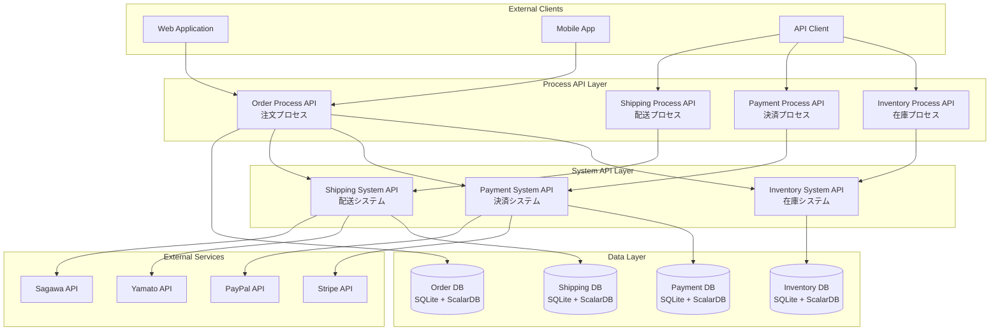
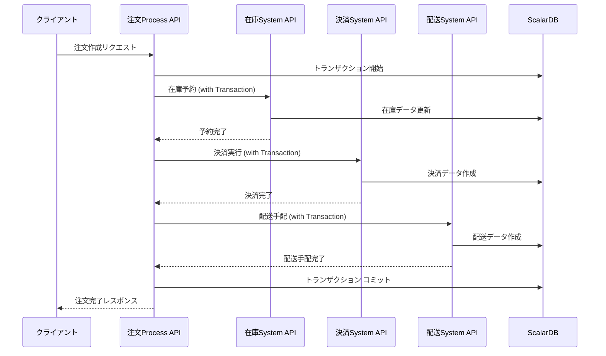
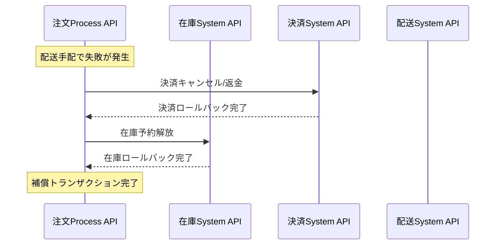

# マイクロサービスAPI アーキテクチャ概要

## システム全体構成



## APIレイヤー設計

### System API（システムAPI）
**目的**: 単一ドメインの基本的なCRUD操作を提供
- **在庫システムAPI**: 商品在庫の管理、予約、消費
- **決済システムAPI**: 決済処理、返金処理
- **配送システムAPI**: 配送手配、追跡、状況管理

### Process API（プロセスAPI）
**目的**: ビジネスプロセス全体を協調・管理

#### 複合Process API
- **注文プロセスAPI**: 在庫確保→決済処理→配送手配の一括実行

#### 単機能Process API  
- **在庫プロセスAPI**: 在庫操作の単一プロセス実行
- **決済プロセスAPI**: 決済操作の単一プロセス実行
- **配送プロセスAPI**: 配送操作の単一プロセス実行

## トランザクション設計

### ScalarDB分散トランザクション



### 補償トランザクション（Saga Pattern）



## データ一貫性戦略

### ACID特性の保証
- **Atomicity**: ScalarDBの分散トランザクションによる原子性保証
- **Consistency**: スキーマ制約とビジネスルール検証
- **Isolation**: SNAPSHOTレベルでの分離保証
- **Durability**: SQLiteファイルベースの永続化

### データ分離
```
┌─────────────────┐    ┌─────────────────┐    ┌─────────────────┐
│  Inventory DB   │    │   Payment DB    │    │   Shipping DB   │
│  ┌───────────┐  │    │  ┌───────────┐  │    │  ┌───────────┐  │
│  │inventory  │  │    │  │payments   │  │    │  │shipments  │  │
│  │_items     │  │    │  │payment    │  │    │  │shipping   │  │
│  │inventory  │  │    │  │_methods   │  │    │  │_items     │  │
│  │_reserv.   │  │    │  │refunds    │  │    │  │shipping   │  │
│  │inventory  │  │    │  │payment    │  │    │  │_events    │  │
│  │_trans.    │  │    │  │_events    │  │    │  │carriers   │  │
│  └───────────┘  │    │  └───────────┘  │    │  └───────────┘  │
└─────────────────┘    └─────────────────┘    └─────────────────┘

┌─────────────────┐
│    Order DB     │
│  ┌───────────┐  │
│  │orders     │  │
│  │order_items│  │
│  │order_proc │  │
│  │_events    │  │
│  │order_comp │  │
│  │ensation   │  │
│  └───────────┘  │
└─────────────────┘
```

## API通信パターン

### 同期通信（REST API）
```yaml
通信方式: HTTP/REST
認証: Bearer Token
データ形式: JSON
タイムアウト: 30-60秒
リトライ: 最大3回、指数バックオフ
サーキットブレーカー: Resilience4j
```

### サービス間連携
```java
// Feign Client例
@FeignClient(name = "inventory-service")
public interface InventoryServiceClient {
    @PostMapping("/inventory-items/reserve")
    InventoryReservationResponse reserveInventory(
        @RequestBody InventoryReservationRequest request);
}
```

## エラーハンドリング戦略

### エラー分類
1. **ビジネスエラー**: 在庫不足、決済失敗等
2. **システムエラー**: データベース接続エラー、外部API障害等
3. **ネットワークエラー**: タイムアウト、接続失敗等

### エラーレスポンス形式
```json
{
  "error_code": "INSUFFICIENT_INVENTORY",
  "error_message": "Requested quantity exceeds available inventory",
  "details": {
    "product_id": "PROD-001",
    "requested_quantity": 10,
    "available_quantity": 5
  },
  "timestamp": "2024-01-01T00:00:00Z",
  "trace_id": "trace-12345"
}
```

## セキュリティ設計

### 認証・認可
```
┌─────────────┐    ┌─────────────┐    ┌─────────────┐
│   Client    │    │   API GW    │    │   Service   │
│             │───▶│             │───▶│             │
│ Bearer Token│    │ JWT検証     │    │ Authorization│
└─────────────┘    └─────────────┘    └─────────────┘
```

### データ保護
- **暗号化**: 決済情報のフィールドレベル暗号化
- **マスキング**: ログ出力時の機密データマスキング
- **監査**: 全API呼び出しの監査ログ記録

## 監視・運用設計

### メトリクス収集
```yaml
ビジネスメトリクス:
  - 注文処理成功率
  - 平均注文処理時間
  - 在庫予約成功率
  - 決済成功率
  - 配送手配成功率

技術メトリクス:
  - API レスポンス時間
  - トランザクション処理時間
  - エラー率
  - スループット

インフラメトリクス:
  - CPU使用率
  - メモリ使用率
  - ディスク使用率
  - データベース接続数
```

### ヘルスチェック
```java
@Component
public class OrderServiceHealthIndicator implements HealthIndicator {
    @Override
    public Health health() {
        // ScalarDB接続確認
        // 外部サービス接続確認
        // ビジネスロジック確認
        return Health.up()
            .withDetail("scalardb", "UP")
            .withDetail("inventory-service", "UP")
            .withDetail("payment-service", "UP")
            .withDetail("shipping-service", "UP")
            .build();
    }
}
```

### ログ設計
```json
{
  "timestamp": "2024-01-01T00:00:00Z",
  "level": "INFO",
  "service": "order-process-api",
  "trace_id": "trace-12345",
  "span_id": "span-67890",
  "user_id": "CUST-001",
  "order_id": "ORDER-001",
  "event": "ORDER_PROCESSING_STARTED",
  "duration_ms": 1500,
  "status": "SUCCESS"
}
```

## パフォーマンス設計

### 想定負荷
```yaml
Peak Load:
  - 注文処理: 100 TPS
  - 在庫照会: 500 TPS
  - 決済処理: 80 TPS
  - 配送追跡: 200 TPS

Response Time SLA:
  - 注文プロセス: < 5秒 (95%ile)
  - System API: < 1秒 (95%ile)
  - 単機能Process API: < 2秒 (95%ile)
```

### スケーリング戦略
```yaml
Horizontal Scaling:
  - 各マイクロサービスの独立スケーリング
  - ロードバランサーによる負荷分散
  - Auto Scaling Group設定

Database Scaling:
  - SQLite: Read Replica (必要に応じて)
  - ScalarDB: 分散トランザクション最適化
  - 接続プール設定
```

## デプロイメント設計

### コンテナ化
```dockerfile
# 共通Dockerfile例
FROM openjdk:17-jdk-slim
WORKDIR /app
COPY target/*.jar app.jar
COPY scalardb.properties scalardb.properties
EXPOSE 8080
HEALTHCHECK --interval=30s --timeout=3s \
  CMD curl -f http://localhost:8080/actuator/health
ENTRYPOINT ["java", "-jar", "app.jar"]
```

### サービス構成
```yaml
# docker-compose.yml例
version: '3.8'
services:
  inventory-service:
    image: inventory-service:latest
    ports: ["8081:8080"]
    environment:
      - SPRING_PROFILES_ACTIVE=docker
    volumes:
      - sqlite-data:/app/data
      
  payment-service:
    image: payment-service:latest
    ports: ["8082:8080"]
    environment:
      - SPRING_PROFILES_ACTIVE=docker
    volumes:
      - sqlite-data:/app/data
      
  shipping-service:
    image: shipping-service:latest
    ports: ["8083:8080"]
    environment:
      - SPRING_PROFILES_ACTIVE=docker
    volumes:
      - sqlite-data:/app/data
      
  order-process-service:
    image: order-process-service:latest
    ports: ["8080:8080"]
    environment:
      - SPRING_PROFILES_ACTIVE=docker
      - INVENTORY_SERVICE_URL=http://inventory-service:8080
      - PAYMENT_SERVICE_URL=http://payment-service:8080
      - SHIPPING_SERVICE_URL=http://shipping-service:8080
    volumes:
      - sqlite-data:/app/data
    depends_on:
      - inventory-service
      - payment-service
      - shipping-service

volumes:
  sqlite-data:
```

## 開発・運用フロー

### CI/CD Pipeline
```yaml
stages:
  - test:
    - ユニットテスト
    - 統合テスト
    - ScalarDBトランザクションテスト
  - build:
    - Dockerイメージビルド
    - セキュリティスキャン
  - deploy:
    - ステージング環境デプロイ
    - End-to-Endテスト
    - 本番環境デプロイ
```

### 本番運用
```yaml
監視:
  - Prometheus + Grafana
  - Application Performance Monitoring
  - ログ集約 (ELK Stack)
  - アラート設定

バックアップ:
  - SQLiteファイルの定期バックアップ
  - 設定ファイルのバックアップ
  - 災害復旧手順

運用手順:
  - サービス再起動手順
  - データベースメンテナンス
  - セキュリティパッチ適用
  - 障害対応手順
```

## 実装優先度

### Phase 1: 基盤構築
1. ✅ 在庫System API
2. ✅ 決済System API  
3. ✅ 配送System API
4. ✅ 注文Process API

### Phase 2: プロセス最適化
5. ✅ 単機能Process API実装
6. 🔄 監視・メトリクス実装
7. 🔄 エラーハンドリング強化
8. 🔄 パフォーマンス最適化

### Phase 3: 運用準備
9. 🔄 セキュリティ強化
10. 🔄 CI/CDパイプライン構築
11. 🔄 本番運用準備
12. 🔄 ドキュメント整備

## 注意事項・制約

### 技術的制約
- **SQLite**: 単一ファイルベース、大規模負荷には不向き
- **ScalarDB**: 複雑なクエリよりもシンプルなCRUD向け
- **ファイルベース**: ネットワーク共有時の注意が必要

### 運用制約
- **トランザクション**: 長時間実行は避ける
- **外部API**: 障害時の補償処理が重要
- **データ一貫性**: 最終的一貫性の受容

### スケーラビリティ制約
- **SQLite**: Read-heavyワークロードでのRead Replica検討
- **分散トランザクション**: ネットワーク分断耐性の考慮
- **サービス間通信**: 同期通信による障害伝播の注意